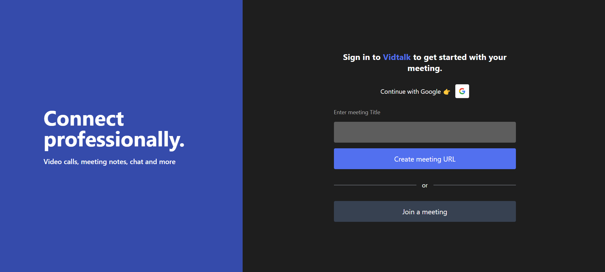
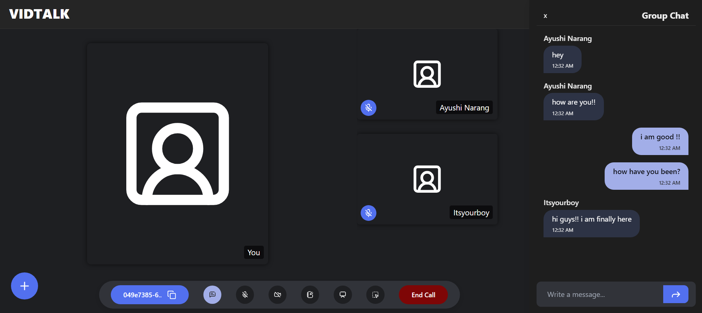
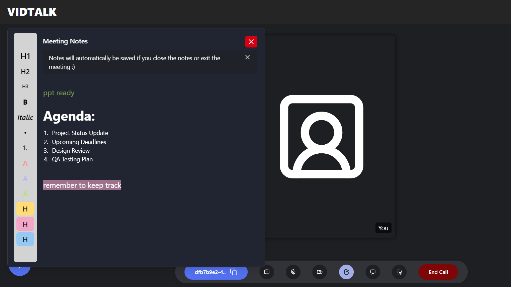
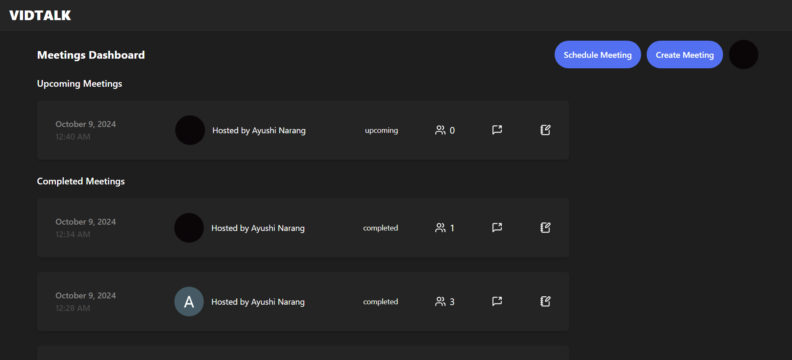
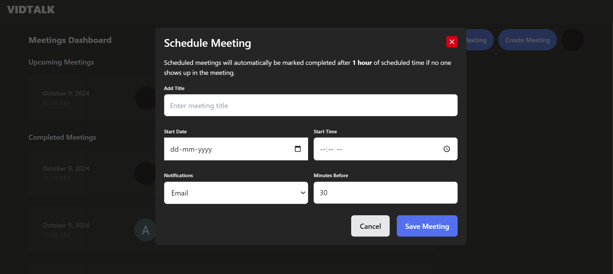
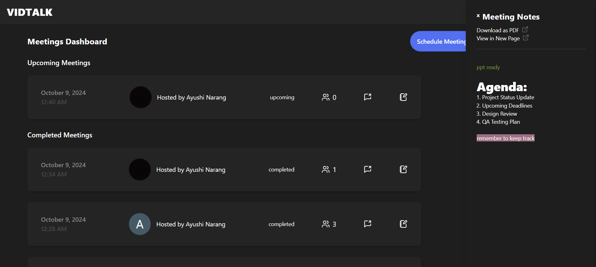
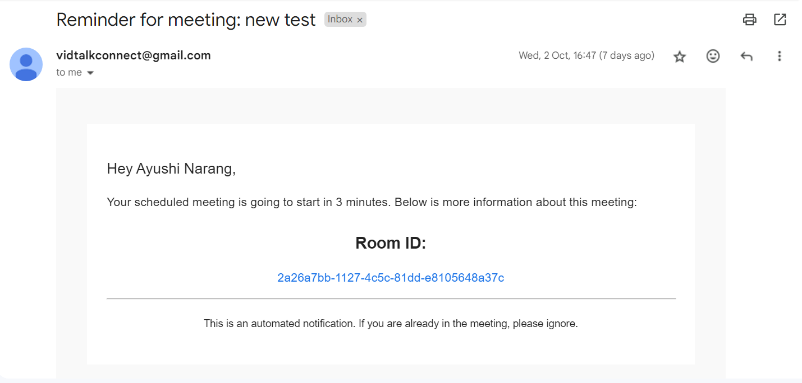
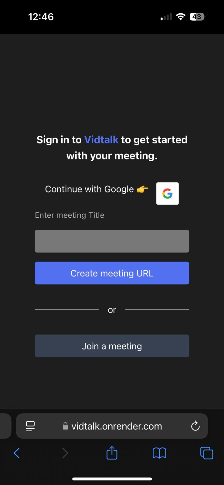
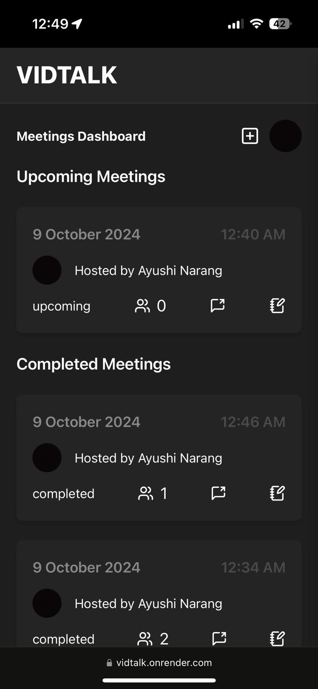

# Vidtalk – Video Conferencing Application

> Vidtalk is a video conferencing application built with the MERN stack. It leverages WebRTC and Socket.io for real-time communication, making it easy for users to connect and collaborate online.

**Live Demo:** [Vidtalk](https://vidtalk.onrender.com/)

**Tech Stack:**

  
  
  
  
  
  

## Features

### OAuth 2.0 Authentication
Users can sign in using Google OAuth 2.0 for secure and quick access.

**Screenshot:**

---

### Join or Host Meetings
After signing in, users can choose to join or host a meeting:
- **Hosting**: Enter a meeting name.
- **Joining**: Enter a meeting URL.

---

### Real-Time Video Calling
Users are navigated to the meeting room where they can engage in video calls with real-time messaging.

**Screenshot:**

---

### Rich Text Notes
Utilize Editor.js to create and format notes during meetings, enabling rich text formatting for enhanced note-taking.

**Screenshot:**

---

### User Controls
Participants can manage their audio and video settings:
- Enable/Disable microphone
- Enable/Disable video
- Share screen
- Take screenshots
- View participants

---

### Participant Capacity
Up to 6 users can join a meeting simultaneously without any issues.

---

### Meeting Management
After the meeting ends, users are redirected to their dashboard where they can:
- View past meetings
- Schedule new meetings
- Access upcoming meetings

**Screenshots:**

---

### Access to Past Meetings
Users can view participants, notes, and messages from previous meetings, with the option to download notes or messages.

**Screenshot:**

---

### Email Notifications
Users receive email notifications scheduled to be sent before the specified number of minutes prior to a meeting.

**Screenshot:**

---

### Responsive Design
The application is fully responsive, ensuring a seamless experience across devices.

   
   

---

## Technologies Used

| Category            | Tech Stack           |
|--------------------|---------------------|
| Frontend          | React.js            |
| Backend           | Node.js, Express.js  |
| Database          | MongoDB             |
| Real-Time Communication | WebRTC, Socket.io |
| Authentication    | Google OAuth 2.0    |
| Rich Text Editor  | Editor.js           |

---

## ⭐ **Like This Project? Support & Connect!**
If you find this project useful, don’t forget to **⭐ Star** the repo!

More about me:  
💻 **Portfolio:** [@ayunarang](https://ayushinarang.vercel.app)  
🔗 **LinkedIn:** [@ayushinarang](https://linkedin.com/in/ayushinarang)
