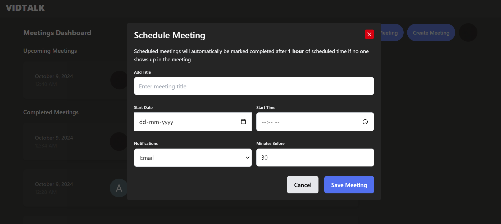

# Vidtalk

Vidtalk is a video conferencing application built with the MERN stack. It leverages WebRTC and Socket.io for real-time communication, making it easy for users to connect and collaborate online.

## Features

1. **OAuth 2.0 Authentication**  
   Users can sign in using Google OAuth 2.0 for secure and quick access.

   

2. **Join or Host Meetings**  
   After signing in, users can choose to join or host a meeting:
   - **Hosting**: Enter a meeting name.
   - **Joining**: Enter a meeting URL.
  
3. **Real-Time Video Calling**  
   Users are navigated to the meeting room where they can engage in video calls with real-time messaging.

   

4. **Rich Text Notes**  
   Utilize Editor.js to create and format notes during meetings, enabling rich text formatting for enhanced note-taking.

   

5. **User Controls**  
   Participants can manage their audio and video settings:
   - Enable/Disable microphone
   - Enable/Disable video
   - Share screen
   - Take screenshots
   - View participants

6. **Participant Capacity**  
   Up to 6 users can join a meeting simultaneously without any issues.
   
7. **Meeting Management**  
   After the meeting ends, users are redirected to their dashboard where they can:
   - View past meetings
   - Schedule new meetings
   - Access upcoming meetings
  
   
   

8. **Access to Past Meetings**  
   Users can view participants, notes, and messages from previous meetings, with the option to download notes or messages.

   

9. **Email Notifications**  
   Users receive email notifications scheduled to be sent before the specified number of minutes prior to a meeting.

   

10. **Responsive Design**  
   The application is fully responsive, ensuring a seamless experience across devices.

   
   

## Technologies Used

- **Frontend**: React.js
- **Backend**: Node.js, Express.js
- **Database**: MongoDB
- **Real-Time Communication**: WebRTC, Socket.io
- **Authentication**: Google OAuth 2.0
- **Rich Text Editor**: Editor.js

## See live demo

[Vidtalk Demo](https://vidtalk.onrender.com/)

